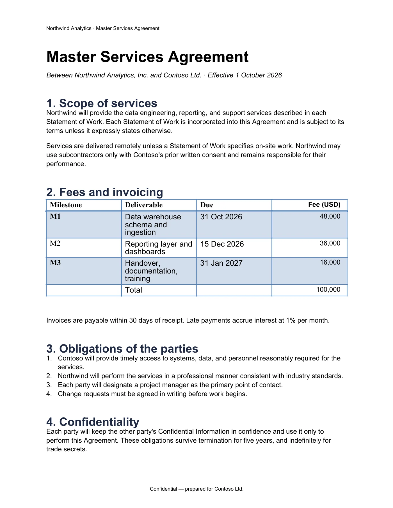
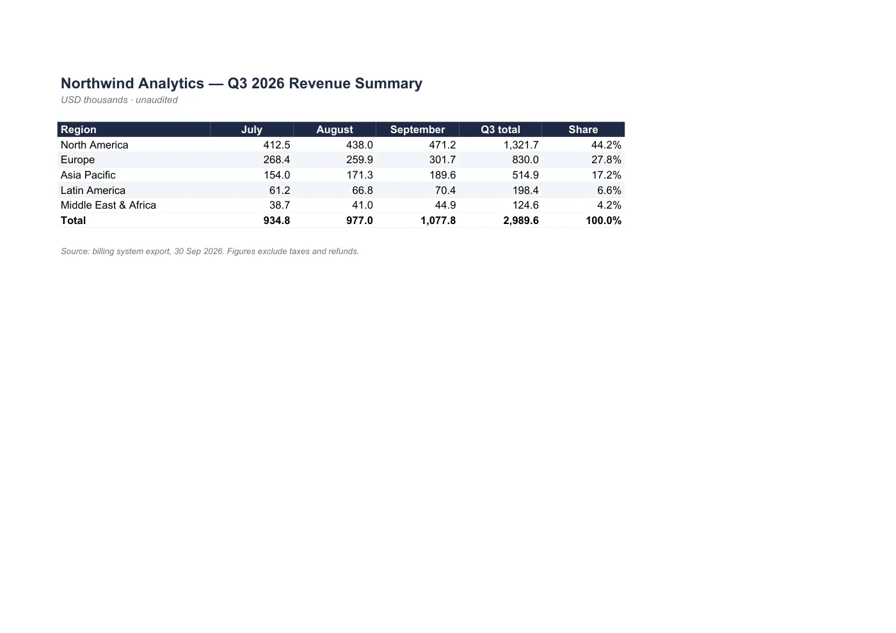
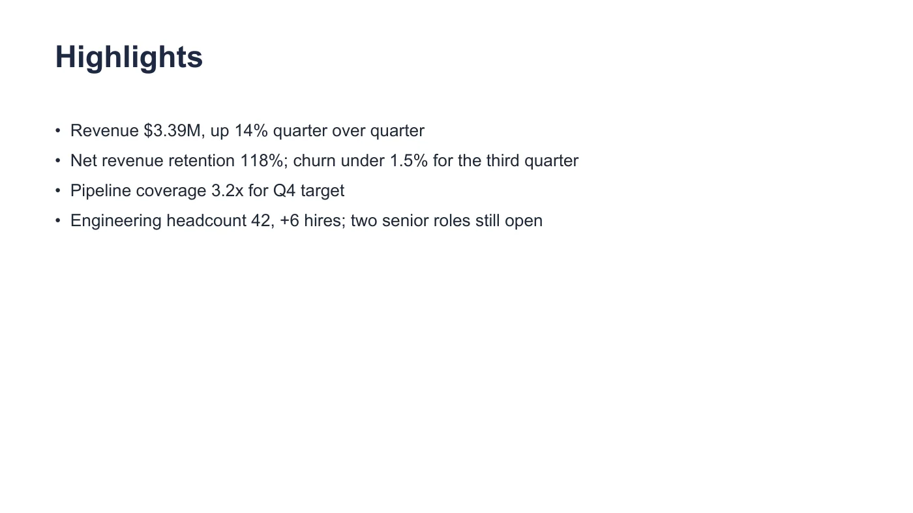

<div align="center">

# Jetformat

### 让终端和 AI Agent 直接处理文档

Word、Excel、PowerPoint 转 PDF，提取结构化文本，编辑文档，合并和预览 PDF。

[](https://github.com/jetformat/jetformat/releases)

[官网](https://jetformat.com) · [下载安装包](https://github.com/jetformat/jetformat/releases/latest) · [命令文档](https://jetformat.com/docs/models) · [English](README.md)

</div>

Jetformat 是运行在本机的文档处理工具。可以直接在终端使用，也可以接入 **Codex、Claude Code 和 DeepSeek Harness**，让 Agent 调用同一套命令完成文档任务。无需安装 Microsoft Office 或 LibreOffice，支持 macOS、Linux 和 Windows。

```bash
npm install -g jetformat
jetformat login
jetformat word to-pdf contract.docx -o contract.pdf
```

## 可以做什么

| 用途 | 命令示例 |
| --- | --- |
| Word 转 PDF | `jetformat word to-pdf contract.docx -o contract.pdf` |
| Excel 转 PDF | `jetformat excel to-pdf workbook.xlsx -o workbook.pdf` |
| PowerPoint 转 PDF | `jetformat ppt to-pdf slides.pptx -o slides.pdf` |
| PDF 转可编辑 Word | `jetformat pdf to-word report.pdf -o report.docx` |
| 提取 Markdown，供 Agent 阅读 | `jetformat text report.docx --format markdown` |
| 提取表格 JSON | `jetformat text workbook.xlsx --format json` |
| 查看 PDF 信息 | `jetformat pdf info report.pdf --json` |
| 合并 PDF | `jetformat pdf merge a.pdf b.pdf -o combined.pdf` |
| 提取连续页面 | `jetformat pdf extract report.pdf --pages 2-5 -o chapter.pdf` |
| 生成首尾页预览 | `jetformat pdf render report.pdf --pages 1,last --width 1600 -o preview` |
| 检查文件是否有效 | `jetformat validate report.docx` |

[更多示例：模板填充、邮件合并、修改单元格、调整幻灯片、批量转换](docs/usage.md)。

## 看看转换效果

以下来自官网的真实样例转换预览，具体效果取决于文档和本机字体。

| Word 合同 | Excel 报表 | PowerPoint 演示文稿 |
| :---: | :---: | :---: |
|  |  |  |

## 安装 Jetformat

**npm：** 支持 macOS、Linux、Windows，需要 Node.js 18 或以上。

```bash
npm install -g jetformat
jetformat --version
```

**Homebrew：** 支持 macOS 和 Linux。

```bash
brew install jetformat/tap/jetformat
```

**直接下载：** 打开 [Releases](https://github.com/jetformat/jetformat/releases/latest)，选择系统与 CPU 对应的安装包，解压后将 `jetformat` 或 `jetformat.exe` 加入 `PATH`。直接下载不需要 Node.js 或 Go。

| 系统 / CPU | 文件名结尾 |
| --- | --- |
| macOS / Apple Silicon | `darwin_arm64.tar.gz` |
| macOS / Intel | `darwin_amd64.tar.gz` |
| Linux / x64 | `linux_amd64.tar.gz` |
| Linux / ARM64 | `linux_arm64.tar.gz` |
| Windows / x64 | `windows_amd64.zip` |
| Windows / ARM64 | `windows_arm64.zip` |

安装包命名为 `jetformat_<版本>_<系统>_<架构>`。`SHA256SUMS` 提供校验值；GitHub 自动生成的 **Source code** 压缩包仅包含本仓库文档，不包含 CLI。

[详细安装、校验和故障排查](docs/installation.md)。

## 接入 AI Agent

先在 Agent 运行的机器上安装 Jetformat CLI。需要转换或写入文件时，先运行 `jetformat login`；无浏览器环境可运行 `jetformat login --device-auth`。

### Claude Code

```bash
claude plugin marketplace add jetformat/jetformat-agent
claude plugin install jetformat@jetformat
```

### Codex

```bash
codex plugin marketplace add jetformat/jetformat-agent
codex plugin add jetformat@jetformat
```

如果当前版本不支持 `codex plugin add`，添加 marketplace 后，在插件界面找到 **Jetformat** 并安装。安装后新开一个会话。

### DeepSeek Harness

```bash
dsh plugin --profile web add github:jetformat/dsh-plugin
```

`web` 是运行 Agent 的 profile；使用其他 profile 时替换为对应名称。这是 **DeepSeek Harness 本地 Agent** 的插件，不是 DeepSeek 网页聊天的扩展。

安装完成后，可以这样提问：

> 把 proposal.docx 转成 PDF，再渲染第一页作为预览，告诉我文件保存在哪里。

> 读取 quarterly-report.xlsx 的可见工作表，按结构化数据汇总收入变化。

> 将 a.pdf 和 b.pdf 合并为 combined.pdf，再告诉我总页数。

[Agent 安装验证与故障排查](docs/agents.md)。

## 费用与隐私

读取文本、查看信息和验证文件免费，无需登录。转换、渲染以及写入文档需要登录并消耗积分，详见[价格](https://jetformat.com/pricing)和[积分说明](https://jetformat.com/help/billing/credits)。

Office 和 PDF 文件在本机处理。CLI 会联网完成登录、积分计量和匿名命令统计；统计不包含文档内容、文件名或路径。可运行 `jetformat telemetry off` 关闭统计，详见[遥测说明](https://jetformat.com/help/security/telemetry)。HTML 转 PDF 使用单独配置的渲染服务，其要求见命令文档。

## 使用边界

- 支持 `.docx`、`.xlsx`、`.pptx`，不支持旧版 `.doc`、`.xls`、`.ppt` 和宏文件。
- 文本提取与 PDF 转 Word 依赖已有文本层，不提供 OCR；PDF 转 Word 不保证逐像素还原。
- Excel 转 PDF 包含可见工作表；PDF 页面提取需要连续范围。
- 排版受本机字体影响，请使用有权使用的字体。

## 反馈与发布

欢迎通过 [Issues](https://github.com/jetformat/jetformat/issues) 提交问题和功能建议，附上 CLI 版本、系统、执行命令和错误信息，优先使用不含敏感内容的最小样例。

这个仓库用于公开文档、下载、问题反馈和自动打包发布。**Jetformat 转换引擎为闭源软件**，本仓库不包含引擎源代码。GitHub Actions 从私有引擎的版本标签编译六个平台安装包，生成 SHA-256 校验文件，并发布到 Releases。维护者参见[发布流程](docs/releasing.md)。

CLI 适用 [Jetformat 服务条款](https://jetformat.com/terms)。[Claude / Codex 插件](https://github.com/jetformat/jetformat-agent)和 [DeepSeek 插件](https://github.com/jetformat/dsh-plugin)采用各自仓库中的许可证。
